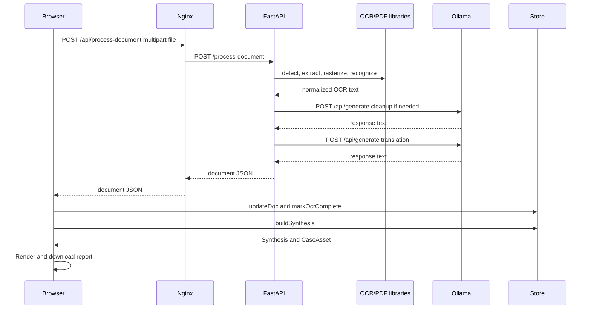

# Clinical Synthesis Hub API Workflow

## API Surface

| Method | Route | Caller | Purpose |
| --- | --- | --- | --- |
| `GET` | `/health` | Deployment probe or operator | Returns `{ "status": "ok" }` |
| `POST` | `/process-document` | `OcrView.run()` through Nginx `/api` proxy | Processes one uploaded PDF or image and returns OCR, translation, fields, classification, and confidence |
| `POST` | `http://localhost:11434/api/generate` | FastAPI `call_ollama()` | Internal model call for OCR cleanup or translation |

The frontend does not currently expose an API endpoint for synthesis or report generation. Those steps run in the browser after document processing. DOCX/PDF generation is also local to the browser after the Docker-served UI receives the synthesis data.

## Internal Component APIs

### Intake

```ts
function ingest(files: FileList | null): void;
function addFiles(files: {
  name: string;
  sizeKb: number;
  language?: string;
  classification?: ClinicalDoc["classification"];
  originalText?: string;
  translatedText?: string;
  sourceFile?: File;
}[]): number;
```

### Document processing

```ts
async function run(): Promise<void>;
function updateDoc(id: string, changes: Partial<ClinicalDoc>): void;
function markOcrComplete(): void;
```

`run()` processes one document at a time, updates the active document and progress state, continues after an individual request failure, then calls `markOcrComplete()`.

### Synthesis

```ts
function buildSynthesis(): Synthesis;
```

`buildSynthesis()` reads processed records from the store, extracts entities and medications, creates timeline events, detects gaps, and returns a new case-scoped `Synthesis`.

### Report

```ts
function markdownReport(
  hospital: { name: string; address: string },
  synthesis: Synthesis,
  docs: ClinicalDoc[],
): string;
async function wordDocument(markdown: string): Promise<Blob>;
function pdfDocument(markdown: string): string;
function download(ext: "docx" | "pdf"): Promise<void>;
```

The report is generated locally and downloaded through a browser `Blob`. The DOCX builder uses the `docx` package; the PDF builder emits a PDF 1.4 byte string. No report payload is posted to the backend.

## `POST /process-document`

### Request

```http
POST /api/process-document HTTP/1.1
Content-Type: multipart/form-data; boundary=...

file=<binary PDF or image>
```

Nginx rewrites `/api/process-document` to `/process-document` and forwards it to the FastAPI container at `http://backend:8000`.

### Response: success

```json
{
  "filename": "outpatient_prescription.pdf",
  "file_type": "application/pdf",
  "language_detected": "ta",
  "classification": "Outpatient Prescription",
  "classifier_confidence": 91.0,
  "pages": 2,
  "ocr_confidence": 86.4,
  "translation_quality": 89.8,
  "ocr_text": "source-language text",
  "translated_text": "English clinical text",
  "patient_name": "Patient name when extracted",
  "fields": {
    "patient_name": "Patient name when extracted",
    "doctor": "Doctor when extracted",
    "mrn": "MRN when extracted"
  },
  "status": "processed"
}
```

The frontend maps these keys as follows:

```text
language_detected       -> ClinicalDoc.language
classification          -> ClinicalDoc.classification
classifier_confidence   -> ClinicalDoc.classifierConfidence
pages                   -> ClinicalDoc.pages
ocr_confidence          -> ClinicalDoc.ocrConfidence
translation_quality     -> ClinicalDoc.translationQuality
ocr_text                -> ClinicalDoc.originalText
translated_text         -> ClinicalDoc.translatedText
patient_name            -> ClinicalDoc.patientName
fields                  -> ClinicalDoc.fields
```

### Error responses

```json
{ "detail": "No filename supplied" }
{ "detail": "No readable text found in uploaded document" }
{ "detail": "OCR cleanup service unavailable; no noisy fallback was used" }
{ "detail": "Translation service unavailable; no fallback translation was used" }
```

| Status | Typical cause | Browser behavior |
| --- | --- | --- |
| 400 | Missing filename | Request fails and document remains unanalyzed |
| 422 | Unsupported or unreadable content | Error toast; no fallback text |
| 500 | Unexpected backend processing error | Error toast; other documents continue |
| 503 | Ollama cleanup/translation unavailable | Error toast; no synthetic translation |

## Ollama Integration

### Endpoint

The implementation uses `POST /api/generate`, not `/api/chat`:

```text
${OLLAMA_HOST.rstrip('/')}/api/generate
```

### Request payload

```json
{
  "model": "llama3.1:8b",
  "prompt": "...instruction plus source text...",
  "stream": false
}
```

The current code does not send `temperature`, `num_ctx`, stop sequences, or a separate system message. Those should be added only as explicit configuration when deterministic model behavior is required.

### OCR cleanup prompt flow

1. `process_document()` obtains extracted OCR.
2. `is_reliable_text()` checks length, noise, script count, and character count.
3. If unreliable, `clean_ocr_text()` sends a preservation prompt to Ollama.
4. `clean_model_output()` strips Markdown fences, emphasis, list prefixes, and empty lines.
5. The backend verifies that regional source script was not lost.

```text
[FastAPI] --(noisy OCR + cleanup instruction)--> [Ollama /api/generate]
[Ollama] --(response field)--> [clean_model_output()]
[clean_model_output()] --(script and reliability checks)--> [cleaned OCR]
```

### Translation prompt flow

1. `get_language_label()` uses `langdetect` on cleaned source text.
2. `translate_text()` builds a language-specific preservation prompt.
3. Ollama returns a non-streaming response.
4. The backend cleans the response and checks for non-English scripts.
5. If regional script remains, the backend makes one English-only retry.
6. If the retry still contains non-English script, HTTP 503 is returned.

### Response parsing

```py
response = httpx.post(url, json=payload, timeout=120.0)
response.raise_for_status()
data = response.json()
return str(data.get("response", ""))
```

No token stream is parsed. A future streaming implementation would need to accumulate Ollama chunks, detect terminal completion, enforce an overall deadline, and validate the final accumulated text before returning it to the browser.

## Chronological API Execution Sequence

1. `IntakeView.ingest()` receives `FileList`.
2. `ClinicalStoreProvider.addFiles()` creates `ClinicalDoc` records.
3. Analyst selects Process records.
4. `OcrView.run()` creates `FormData` and appends `file`.
5. Browser calls `fetch('/api/process-document', { method: 'POST', body: formData })`.
6. Nginx rewrites and proxies to FastAPI.
7. FastAPI saves the upload to a temporary path.
8. `detect_file_kind()` chooses PDF, image, or unsupported branch.
9. OCR functions produce normalized text.
10. `clean_ocr_text()` may call Ollama `/api/generate`.
11. `get_language_label()` detects source language.
12. `translate_text()` calls Ollama `/api/generate` and validates English output.
13. `extract_fields()` and `classify_document_from_text()` produce metadata.
14. FastAPI returns structured JSON and removes the temporary file.
15. `OcrView.run()` calls `updateDoc()`.
16. After all records, `markOcrComplete()` checks completeness.
17. Analyst selects Prepare summary.
18. `buildSynthesis()` creates the case context and `CaseAsset` locally.
19. Analyst selects Generate report.
20. `markReportReady()` updates report state.
21. `markdownReport()` creates the canonical section/table structure.
22. `wordDocument()` or `pdfDocument()` converts that structure into a browser Blob.
23. The browser starts a download using `${caseId}-medical-report.docx` or `${caseId}-medical-report.pdf`.



## Timeout and Retry Policy

- Ollama calls use a 120-second `httpx` timeout.
- Translation performs one additional English-only validation retry if non-English script remains.
- The frontend does not retry failed API requests automatically; the analyst can select Process again.
- Nginx allows 180 seconds for upstream read and send operations.
- There is no request ID, circuit breaker, rate limiter, or server-side job queue in the current implementation.

## Docker API Routing

When running through Compose, the browser calls `http://localhost:8080/api/process-document`. Nginx inside the frontend container removes the `/api` prefix and forwards the request to `http://backend:8000/process-document` over the Compose network. The backend then calls `http://host.docker.internal:11434/api/generate` for Ollama. Report downloads do not traverse Nginx a second time; they are created directly by the browser.
