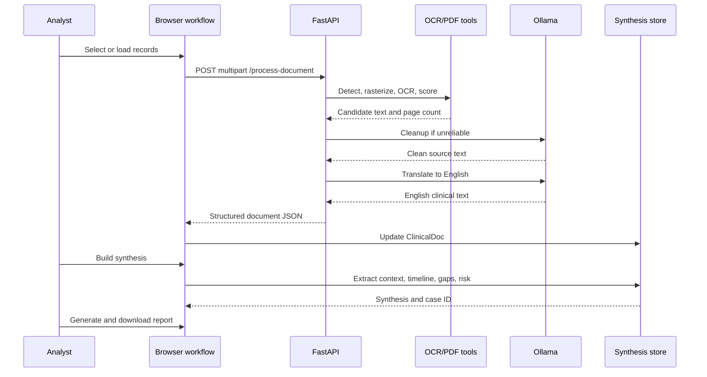

# Clinical Synthesis Hub Dataflow

## Lifecycle Summary

```text
Step 1: Raw Document File
  -> Step 2: File signature and type
  -> Step 3: Rasterized page images or embedded PDF text
  -> Step 4: Candidate OCR text
  -> Step 5: Cleaned source-language text
  -> Step 6: Translated English text
  -> Step 7: Structured document JSON
  -> Step 8: Persisted ClinicalDoc
  -> Step 9: Structured Synthesis
  -> Step 10: Canonical report structure
  -> Step 11: DOCX/PDF formatted output
```

## Step-by-Step Data Lifecycle

### Stage 1: Raw Document File

- **Input data type:** Browser `File` selected by the analyst.
- **Transformation:** `IntakeView.ingest()` maps the file into an `addFiles()` argument.
- **Output schema:** `{ name, sizeKb, sourceFile }`.
- **Storage/memory:** `sourceFile` remains in browser memory; metadata is held by React state and later serialized where possible.
- **Failure edge:** Empty selection is ignored. Unsupported file types are prevented by the UI accept list, but the backend still validates file signatures.

### Stage 2: Intake Record

- **Input:** File metadata and optional fixture metadata.
- **Transformation:** `ClinicalStoreProvider.addFiles()` creates a `ClinicalDoc`.
- **Output schema:**

```ts
interface ClinicalDoc {
  id: string;
  name: string;
  origin?: "sample" | "upload";
  sourceFile?: File;
  language: string;
  pages: number;
  sizeKb: number;
  classification?: DocClass;
  classifierConfidence: number;
  originalText: string;
  translatedText: string;
  ocrConfidence: number;
  translationQuality: number;
  processed: boolean;
}
```

- **Storage/memory:** React store; persisted under `chss.session.v9` when serialization succeeds.

### Stage 3: File Detection

- **Input:** Temporary backend path.
- **Transformation:** `filetype.guess()` inspects bytes rather than trusting only the filename.
- **Output:** `application/pdf`, an `image/*` MIME type, or `application/octet-stream`.
- **Storage/memory:** Temporary filesystem file.
- **Failure edge:** Unknown binary content results in an empty extraction path and HTTP 422.

### Stage 4: PDF or Image Extraction

- **Input:** PDF or image file path.
- **Transformation:**
  - PDF: `pypdf.PdfReader` counts pages and reads embedded text; PyMuPDF renders each page at a 2.5 scale when OCR is needed.
  - Image: PIL opens the image and converts it into an array for RapidOCR.
- **Output:** normalized candidate text and page count.
- **Storage/memory:** In-memory strings and image arrays; PDF temporary file remains until request cleanup.
- **Failure edge:** Page-level OCR exceptions produce an empty page; an entirely empty result returns HTTP 422.

### Stage 5: OCR Candidate Selection

- **Input:** RapidOCR output, Tesseract output, and any embedded PDF text.
- **Transformation:** Normalize whitespace, compare noise, script, meaningful-character, and line scores, then choose the best candidate.
- **Output:** source-language OCR text plus an estimated confidence between 80.0 and 96.0 for non-empty content.
- **Storage/memory:** Backend request memory.
- **Failure edge:** Unreliable text is sent to Ollama cleanup. If Ollama is unavailable, cleanup raises HTTP 503; no noisy fallback is returned.

### Stage 6: OCR Cleanup

- **Input:** Candidate OCR text.
- **Transformation:** `clean_ocr_text()` calls Ollama `/api/generate` with a preservation prompt. The prompt prohibits translation, summarization, invention, and value normalization.
- **Output:** Clean plain text in the original source script, or `[unreadable]` markers for uncertain content.
- **Storage/memory:** Backend request memory; Ollama owns the transient model request.
- **Validation:** The backend rejects empty output, very short unreadable output, or a cleanup response that changes a regional script to another script.

### Stage 7: Translation

- **Input:** Clean source-language text and detected language code.
- **Transformation:** `translate_text()` calls Ollama with a clinical translation prompt and requests English-only output while preserving names, numbers, dates, diagnoses, medication details, and table rows.
- **Output:** Translated English document text.
- **Storage/memory:** Backend request memory.
- **Failure edge:** Ollama timeout, empty response, or persistent non-English output returns HTTP 503. The browser marks the document failed and uses no fallback translation.

### Stage 8: Structured Document JSON

- **Input:** Cleaned OCR and translated strings.
- **Transformation:** Extract fields from both texts, classify translated content using keyword rules, and calculate translation quality.
- **Output schema:**

```json
{
  "filename": "record.pdf",
  "file_type": "application/pdf",
  "language_detected": "ta",
  "classification": "Outpatient Prescription",
  "classifier_confidence": 90.0,
  "pages": 2,
  "ocr_confidence": 86.4,
  "translation_quality": 89.8,
  "ocr_text": "...",
  "translated_text": "...",
  "patient_name": "...",
  "fields": { "patient_name": "...", "doctor": "...", "mrn": "..." },
  "status": "processed"
}
```

### Stage 9: Client Record Update

- **Input:** JSON response from `/process-document`.
- **Transformation:** `OcrView.run()` maps response keys to `ClinicalDoc` properties through `updateDoc()`.
- **Output:** Analyzed record with original text, translated text, fields, class, page count, and confidence values.
- **Storage/memory:** React context and browser persistence. The upload `File` object itself is not reliably serializable.
- **Completion rule:** `markOcrComplete()` requires every document to be analyzed with non-empty original and translated text.

### Stage 10: Structured Synthetic Context

- **Input:** Processed `ClinicalDoc[]`.
- **Transformation:** `buildSynthesis()` cleans translated boilerplate, combines text, extracts identity and clinical entities, creates timeline events, and calls gap detection.
- **Output schema:**

```ts
interface Synthesis {
  caseId: string;
  patientName: string;
  age: number;
  sex: string;
  mrn: string;
  physicians: string[];
  diagnoses: { code: string; label: string }[];
  medications: { name: string; dosage: string; frequency: string; since: string }[];
  vitals: { label: string; trend: string; value: string; status: "normal" | "watch" | "high" }[];
  timeline: TimelineEvent[];
  gaps: string[];
  risk: "STABLE" | "ACTION REQUIRED" | "CRITICAL RISK";
  createdAt: number;
}
```

### Stage 11: Canonical Report and DOCX/PDF Output

- **Input:** `Synthesis`, source `ClinicalDoc[]`, and facility header values.
- **Transformation:** `markdownReport()` builds the title, metadata table, risk block, table of contents, 13 numbered sections, and fixed table schemas. The same canonical structure is parsed by `wordDocument()` for DOCX generation and converted into wrapped PDF text by `pdfDocument()`.
- **Output:** `${caseId}-medical-report.docx` or `${caseId}-medical-report.pdf`.
- **Storage/memory:** Generated in browser memory and transferred to a Blob download. It is not automatically written to the backend.

### Stage 12: Docker Request Boundary

- **Input:** Browser request to `/api/process-document`.
- **Transformation:** Nginx in the frontend container rewrites and proxies the request to the backend container. The backend container runs the OCR and Ollama calls, then returns JSON through the same proxy.
- **Output:** Browser-visible document JSON and local report artifacts.
- **Storage/memory:** Docker network traffic and temporary backend filesystem storage; the uploaded file is removed after processing.

## Error Handling and Edge Flows

| Condition | Detection point | Behavior |
| --- | --- | --- |
| No filename | FastAPI endpoint | HTTP 400 |
| Unknown/unsupported binary | File detection | HTTP 422 after no readable text |
| Empty OCR | PDF/image extraction | HTTP 422 |
| Low-confidence/noisy OCR | `is_reliable_text()` | Ollama cleanup attempt |
| Ollama cleanup unavailable | `call_ollama()` | HTTP 503; no noisy fallback |
| Source script changed by cleanup | Script validation | HTTP 503 |
| Translation unavailable | Ollama call | HTTP 503; no fallback translation |
| Browser request failure | `OcrView.run()` | Document remains unanalyzed; error toast; other files continue |
| Missing identity field | Synthesis extraction | `Patient not identified` or `Not specified` |
| Missing expected document class | Report rendering | Gap narrative and explicit missing-type statement |
| Browser storage failure | Store effects | Session remains in memory |

## Diagram Blueprint

```text
Step 1 [Analyst selects File]
  -> Step 2 [IntakeView creates ClinicalDoc]
  -> Step 3 [POST multipart /process-document]
  -> Step 4 [Detect MIME and branch PDF/Image]
  -> Step 5 [Extract embedded text or rasterize pixels]
  -> Step 6 [Run RapidOCR/Tesseract and score candidates]
  -> Step 7 [Optional Ollama OCR cleanup]
  -> Step 8 [Detect language and call Ollama translation]
  -> Step 9 [Extract fields and classify document]
  -> Step 10 [Return structured JSON]
  -> Step 11 [Update ClinicalDoc and mark OCR complete]
  -> Step 12 [Build Synthesis and CaseAsset]
  -> Step 13 [Render canonical 13-section report structure]
  -> Step 14 [Build DOCX or PDF Blob]
  -> Step 15 [Download report artifact]
```


