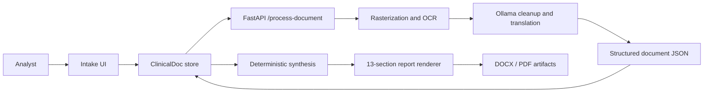

# Clinical Synthesis Hub Overview

## Executive Summary

Clinical Synthesis Hub is a browser-based clinical document processing prototype. It accepts multiple medical records, preserves the original files in a patient-scoped workspace, sends uploaded PDFs or images to an optional FastAPI processing service, and presents OCR text beside an English translation. A deterministic synthesis layer then builds a patient identity, diagnoses, medications, timeline, documentation gaps, and risk rating. The report view renders those results as a continuous executive medical report and supports template-structured DOCX and PDF export.

The system is designed for synthetic and research workflows. It is not a clinical decision-making system. Missing fields are represented as unavailable, and the backend deliberately fails rather than silently substituting fallback text when OCR cleanup or translation cannot be trusted.

## Core Capabilities

- Multi-file intake for PDF, PNG, JPG, TIFF, and WEBP records.
- Drag-and-drop staging with file name, size, generated record ID, and processing state.
- Deterministic multilingual sample case containing Tamil, Telugu, Spanish, Hindi, and English records.
- PDF text extraction and rasterisation through PyMuPDF, with embedded-text and image-OCR selection.
- Image OCR using RapidOCR and Tesseract preprocessing/recognition paths.
- Language detection with `langdetect` and document classification using filename/text heuristics.
- Optional local Ollama calls for noisy OCR cleanup and source-language-to-English translation.
- Entity extraction for patient name, doctor, phone, MRN, diagnoses, medications, dates, and timeline details.
- Chronological synthesis with gap detection and `STABLE`, `ACTION REQUIRED`, or `CRITICAL RISK` output states.
- Template-aligned 13-section executive report generation.
- Client-side persistence through browser `localStorage` with patient folders and case assets.
- Export to real `.docx` and `.pdf` artifacts without requiring a remote document service.

## End-to-End Pipeline Workflow

1. The analyst authenticates through the mock authentication screen.
2. The analyst uploads one or more supported files or loads the deterministic sample case.
3. The intake store creates a `ClinicalDoc` record for each file with a UUID, file metadata, empty processing fields, and `processed: false`.
4. The OCR view iterates through documents in intake order.
5. For an uploaded file, the browser posts multipart form data to `POST /api/process-document`.
6. The backend detects the file MIME type and chooses the PDF or image processing path.
7. PDF pages are inspected for embedded text and rasterised with PyMuPDF when OCR is required. Images are processed directly.
8. RapidOCR and Tesseract candidates are normalized and scored. The backend chooses the best available text and estimates OCR confidence.
9. Unreliable OCR is sent to Ollama for conservative cleanup. The cleanup prompt preserves fields, numbers, names, dates, units, table rows, and source language.
10. The backend detects the source language and calls Ollama to translate the cleaned content into English while preserving clinical values and labels.
11. The backend extracts fields, classifies the document, calculates translation quality, and returns a structured JSON result.
12. The browser updates the `ClinicalDoc` with original OCR text, translated text, language, class, fields, confidence values, page count, and analysis flags.
13. Once every document has usable original and translated text, the store marks OCR complete.
14. The synthesis view combines cleaned translated records, extracts entities and medications, creates timeline events, detects gaps, assigns a risk state, and creates a case ID.
15. The report view reconciles the synthesis with source documents and prepares the 13-section report structure.
16. The analyst selects Generate report, which marks the report ready after the UI composition state completes.
17. The analyst downloads the report as a template-structured `.docx` or `.pdf` artifact.



## Key System Entities & Boundaries

| Entity or boundary | Responsibility | Current implementation |
| --- | --- | --- |
| `ClinicalDoc` | One raw or processed clinical record | TypeScript interface in `src/lib/clinical/data.ts` |
| `Synthesis` | Patient-level facts, diagnoses, medications, vitals, timeline, gaps, and risk | TypeScript interface plus `buildSynthesis()` in the client store |
| `PatientFolder` | Case-scoped collection of records and generated synthesis | Browser-persisted store structure |
| Intake boundary | Accepts user-selected files and sample fixtures | `IntakeView` and `addFiles()` |
| Processing boundary | Converts a file into OCR and translation JSON | FastAPI `/process-document` |
| Ollama boundary | Optional local model service for cleanup and translation | `OLLAMA_HOST` and `OLLAMA_MODEL`; default `http://localhost:11434` and `llama3.1:8b` |
| Synthesis boundary | Converts translated text into structured clinical context | Client-side regex/entity extraction and gap detection |
| Rendering boundary | Maps context to fixed report sections and export formats | `ReportView.tsx` |
| Storage boundary | Preserves session state across navigation and reloads | `localStorage`, key `chss.session.v9` |
| Output boundary | Delivers reviewable or downloadable artifacts | Browser Blob downloads |

## Operational Scope

## Docker Deployment and Functionality

Docker Compose runs the frontend and backend as separate containers. The frontend image builds the TanStack Start application with Node.js 22, then runs Nginx on port 80. Nginx serves the application through the internal TanStack server on port 3000 and rewrites `/api/*` requests to the backend container on port 8000. The backend image uses Python 3.12, installs Tesseract language packs plus the Python OCR stack, and exposes FastAPI.

```text
[Host :8080]
  -> [frontend container :80 / Nginx]
      -> [TanStack server :3000] for UI and report downloads
      -> [backend container :8000] for /api/process-document
          -> [host Ollama :11434] for OCR cleanup and translation
```

`docker compose up --build` builds both images and starts the connected workflow. The frontend container proxies processing requests; the backend writes each upload to temporary storage, deletes it after processing, and does not persist uploaded files to a Docker volume. Ollama is external to Compose and is addressed as `host.docker.internal:11434`.

The sample data is synthetic. Production deployment would require authentication, access control, encrypted storage, audit logging, validated clinical terminology handling, model governance, and human review controls.
