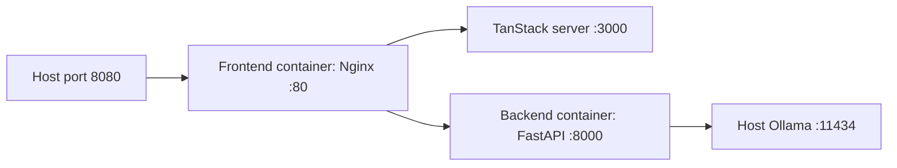

# Clinical Synthesis Hub Technology Stack

## Runtime and Languages

| Area | Technology | Evidence in repository | Role |
| --- | --- | --- | --- |
| Frontend language | TypeScript | `tsconfig.json`, `.tsx` sources | UI, state, synthesis, report formatting |
| Frontend runtime | Node.js 22 in Docker | `Dockerfile.frontend` | Build and serve the TanStack Start output |
| UI framework | React 19 | `package.json` | Component rendering |
| Application framework | TanStack Start and TanStack Router | `@tanstack/react-start`, `@tanstack/react-router` | SPA/SSR entry and routing |
| Build tool | Vite 8 | `vite.config.ts`, `package.json` | Development server and production build |
| Backend language | Python 3.12 | `backend/Dockerfile` | OCR and translation API |
| Backend framework | FastAPI 0.115 | `backend/requirements.txt` | HTTP endpoint and multipart upload handling |
| Backend server | Uvicorn 0.30 | `requirements.txt` | ASGI process |
| Reverse proxy | Nginx | `nginx/default.conf`, frontend image | `/api` proxy and frontend upstream |

## Frontend Dependency Tree

```text
React 19
  -> TanStack Start / Router
  -> Radix UI primitives
  -> Tailwind CSS 4 + tw-animate-css
  -> lucide-react icons
  -> Recharts
  -> Sonner notifications
  -> React Hook Form + Zod (available dependencies)
  -> browser localStorage and Blob APIs
```

Important installed frontend packages include:

- `@tanstack/react-start`, `@tanstack/react-router`, and `@tanstack/react-query`.
- `lucide-react` for interface icons.
- `recharts` for dashboard charts.
- Radix packages for accessible UI primitives.
- `sonner` for success/error/info notifications.
- `date-fns`, `zod`, `react-hook-form`, and related UI packages.

The report renderer uses the Markdown-shaped canonical structure as an internal representation. The `docx` npm package generates real Office Open XML DOCX bytes, while `pdfDocument()` generates a minimal PDF 1.4 text document from the same report content.

## Backend Document and Processing Libraries

| Library | Version | Role |
| --- | --- | --- |
| `filetype` | 1.2.0 | Detect binary file type from file content |
| `pypdf` | 5.0.1 | Read PDF page count and embedded text |
| `PyMuPDF` / `fitz` | 1.24.10 | Render PDF pages into raster images |
| `Pillow` | 10.4.0 | Open, grayscale, autocontrast, and threshold images |
| `numpy` | 1.26.4 | Convert image data for OCR engines |
| `rapidocr-onnxruntime` | 1.3.24 | Primary image OCR path |
| `pytesseract` | 0.3.13 | Tesseract candidate OCR with language packs |
| `langdetect` | 1.0.9 | Source-language detection |
| `httpx` | 0.27.2 | Synchronous HTTP calls to Ollama |

The project does not currently install EasyOCR, PaddleOCR, `pytesseract`-managed model packages, MarianMT, Hugging Face Transformers, Jinja2, `python-docx`, or a PDF generation library. Tesseract language data is installed in the backend image through Debian packages: English, Hindi, Tamil, Telugu, and Spanish.

## OCR and Rasterization Pipeline

```text
[PDF]
  -> pypdf embedded text check
  -> PyMuPDF page rasterization at Matrix(2.5, 2.5)
  -> RapidOCR image recognition
  -> Tesseract variants: original, grayscale, thresholded; PSM 6 and 11
  -> candidate scoring and selection

[Image]
  -> Pillow open
  -> RapidOCR + Tesseract candidate generation
  -> candidate scoring and selection
```

Confidence is an application estimate rather than a calibrated model probability. `estimate_confidence()` maps non-empty text length to a bounded value from 80.0 to 96.0.

## LLM Runtime

| Setting | Current value | Source |
| --- | --- | --- |
| Runtime | Ollama | `backend/app.py`, `backend/README.md` |
| Default model | `llama3.1:8b` | `OLLAMA_MODEL` default and Compose |
| Endpoint | `http://localhost:11434/api/generate` by default | `OLLAMA_HOST` plus route |
| Streaming | Disabled | Payload contains `"stream": false` |
| Timeout | 120 seconds | `httpx.post()` |
| Prompt roles | One combined prompt string | No separate system message |
| Context parameter | Not set | No `num_ctx` in current payload |
| Temperature | Not set | Ollama default applies |

Ollama is used for two backend tasks:

1. Conservative cleanup of unreliable OCR while preserving source language and values.
2. Translation of cleaned text into English while preserving clinical fields and table rows.

The current frontend synthesis and report generation do not call an LLM. Names such as Llama, Mixtral, or Qwen should be treated as model replacement options, not as current dependencies, unless the deployment changes `OLLAMA_MODEL` and validates the resulting behavior.

## Translation and NLP

- `langdetect.detect()` supplies a short source language label such as `ta`, `te`, `hi`, `es`, or `en`.
- Ollama translates the cleaned source text through a prompt that asks for faithful clinical English.
- `has_non_english_script()` validates the translated output using Devanagari, Tamil, and Telugu ranges.
- Backend field extraction uses regular expressions for patient name, physician, phone, and MRN in English, Hindi, Tamil, and Telugu.
- Client synthesis uses regular expressions for age, sex, diagnosis labels, medication lines, dates, facility text, and gap conditions.

No external hosted translation API is required by the current implementation.

## Templating and Formatting

| Artifact | Implementation | Notes |
| --- | --- | --- |
| On-screen report | React JSX in `ReportView.tsx` | 13 sections and HTML tables |
| Markdown | `markdownReport()` | Stable metadata block, TOC, headings, and escaped tables |
| Word download | `wordDocument()` and `docx` | Real Office Open XML `.docx` document with headings and tables |
| PDF download | `pdfDocument()` | Minimal PDF 1.4 text object generation |
| Reference template | `src/sample_doc/Sample_Executive_Medical_Report_Template.docx` | Used as the structural source for headings and table layouts |
| Canonical report parser | `parseMarkdownReport()` | Converts stable headings, paragraphs, and tables into DOCX blocks |
| DOCX parser | None | The reference DOCX is a repository fixture, not parsed at runtime |

## Infrastructure and Storage

### Docker topology

```text
[Browser]
   |
   v
[frontend container: Nginx :80]
   |-- /       -> [TanStack Start server :3000]
   `-- /api/*  -> [backend container :8000]
                         |
                         `-- HTTP -> [Ollama on host :11434]
```

`docker-compose.yml` starts:

- `clinical-synthesis-backend`, built from `backend/Dockerfile`, with OCR system packages and Python dependencies.
- `clinical-synthesis-frontend`, built from `Dockerfile.frontend`, exposed as port `8080`.
- Ollama is not a Compose service; the backend reaches the host runtime through `host.docker.internal`.

### Docker functionality

Docker provides the reproducible runtime boundary for the two application tiers:

1. The backend image starts from `python:3.12-slim`, installs system libraries for image handling and Tesseract language packs, installs `backend/requirements.txt`, and runs Uvicorn on port 8000.
2. The frontend image uses a Node.js 22 build stage to run `npm install` and `npm run build`, then packages the generated `.output` with Nginx and the TanStack server.
3. Nginx listens on port 80, proxies `/api/` to the backend service, and proxies `/` to the internal frontend server on port 3000.
4. Host port 8080 maps to the frontend container, so users access the complete workflow at `http://localhost:8080`.
5. Compose supplies `OLLAMA_HOST=http://host.docker.internal:11434` and `OLLAMA_MODEL=llama3.1:8b` to the backend.
6. No clinical-data volume is configured. Uploads exist in backend temporary storage only for the duration of processing, while browser session data remains in `localStorage`.



### Filesystem and memory

- Backend uploads are written to a temporary file and deleted in a `finally` block.
- PDF page images, OCR strings, and model responses are held in request memory.
- Frontend case state is held in React context and persisted in browser `localStorage` under `chss.session.v9`.
- Browser `File` objects are not a durable server-side asset store.
- No PostgreSQL, Supabase, object storage, IndexedDB, or server-side report repository is implemented.
- The UUID and `CaseAsset` structures simulate database asset slots for the prototype.

### CPU and GPU requirements

- The backend image includes CPU-compatible OCR dependencies and Tesseract binaries.
- PyMuPDF, RapidOCR, and Tesseract can run on CPU; processing time depends on page count and scan resolution.
- Ollama requires sufficient host CPU/RAM for the selected model and benefits from a compatible GPU, but the repository does not enforce a hardware profile.
- The default 8B model should be treated as a local development baseline, not a validated clinical production configuration.

## Build and Run Commands

```powershell
npm install
npm run dev
npm run build
npm run lint
```

```powershell
cd backend
python -m venv .venv
.venv\Scripts\Activate.ps1
pip install -r requirements.txt
uvicorn app:app --host 0.0.0.0 --port 8000 --reload
```

```powershell
ollama pull llama3.1:8b
ollama serve
```

For the container path:

```powershell
docker compose up --build
```

The frontend is then exposed on `http://localhost:8080`.

## Production Gaps

1. Add authentication and authorization beyond the mock login screen.
2. Encrypt records in transit and at rest and remove PHI from browser persistence.
3. Add model version pinning, prompt/version audit, calibrated confidence, and human sign-off.
4. Replace heuristic classification and regex synthesis with tested clinical extraction contracts.
5. Add a durable object store and database rather than treating `localStorage` as persistence.
6. Add API request IDs, rate limits, structured logging, retry policy, and health checks for Ollama.
7. Use validated DOCX and PDF libraries when legal or clinical document fidelity is required.
